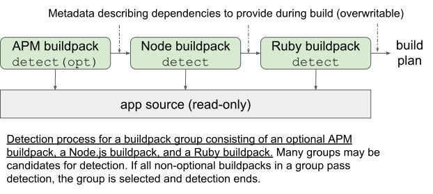
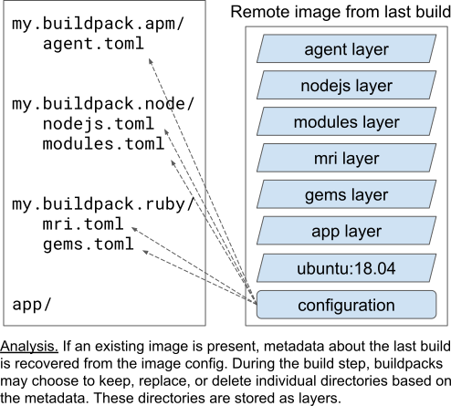
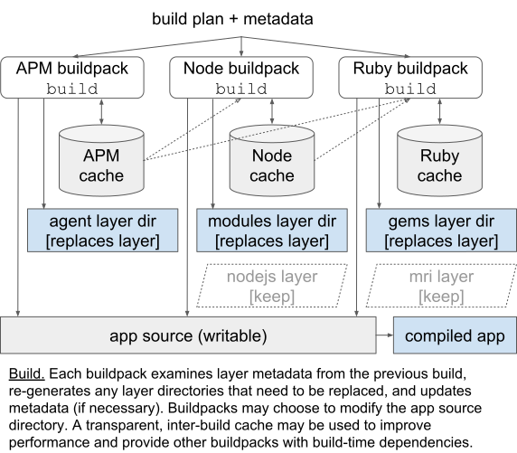
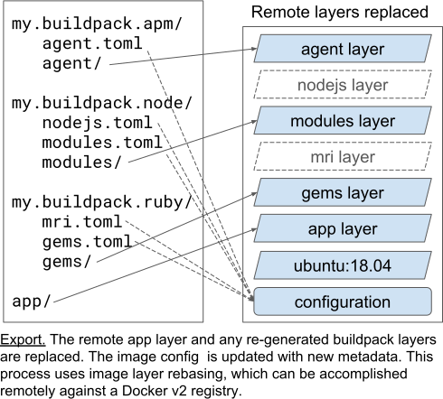

# Buildpack Interface Specification

This document specifies the interface between a lifecycle program and one or more buildpacks.

## Table of Contents

<!-- Using https://github.com/yzhang-gh/vscode-markdown to manage toc -->
- [Buildpack Interface Specification](#buildpack-interface-specification)
  - [Table of Contents](#table-of-contents)
  - [Buildpack API Version](#buildpack-api-version)
  - [Buildpack Interface](#buildpack-interface)
    - [Buildpack API Compatibility](#buildpack-api-compatibility)
    - [Key](#key)
    - [Detection](#detection)
    - [Build](#build)
    - [Exec.d](#execd)
    - [Layer Types](#layer-types)
      - [Launch Layers](#launch-layers)
      - [Build Layers](#build-layers)
      - [Cached Layers](#cached-layers)
      - [Ignored Layers](#ignored-layers)
  - [App Interface](#app-interface)
  - [Phase #1: Detection](#phase-1-detection)
    - [Purpose](#purpose)
    - [Process](#process)
      - [Order Resolution](#order-resolution)
  - [Phase #2: Analysis](#phase-2-analysis)
    - [Purpose](#purpose-1)
    - [Process](#process-1)
  - [Phase #3: Build](#phase-3-build)
    - [Purpose](#purpose-2)
    - [Process](#process-2)
      - [Unmet Buildpack Plan Entries](#unmet-buildpack-plan-entries)
      - [Software Bill of Materials](#software-bill-of-materials)
      - [Layers](#layers)
        - [Providing Layers](#providing-layers)
        - [Reusing Layers](#reusing-layers)
        - [Slice Layers](#slice-layers)
  - [Phase #4: Export](#phase-4-export)
    - [Purpose](#purpose-3)
    - [Process](#process-3)
  - [Launch](#launch)
    - [Purpose](#purpose-4)
    - [Process](#process-4)
  - [Environment](#environment)
    - [Provided by the Lifecycle](#provided-by-the-lifecycle)
      - [Buildpack Specific Variables](#buildpack-specific-variables)
      - [Layer Paths](#layer-paths)
    - [Provided by the Platform](#provided-by-the-platform)
    - [Provided by the Buildpacks](#provided-by-the-buildpacks)
      - [Environment Variable Modification Rules](#environment-variable-modification-rules)
        - [Append](#append)
        - [Default](#default)
        - [Delimiter](#delimiter)
        - [Override](#override)
        - [Prepend](#prepend)
  - [Security Considerations](#security-considerations)
    - [Assumptions of Trust](#assumptions-of-trust)
    - [Requirements](#requirements)
  - [Data Format](#data-format)
    - [launch.toml (TOML)](#launchtoml-toml)
    - [build.toml (TOML)](#buildtoml-toml)
    - [store.toml (TOML)](#storetoml-toml)
    - [Build Plan (TOML)](#build-plan-toml)
    - [Buildpack Plan (TOML)](#buildpack-plan-toml)
    - [Layer Content Metadata (TOML)](#layer-content-metadata-toml)
    - [buildpack.toml (TOML)](#buildpacktoml-toml)
      - [Buildpack Implementations](#buildpack-implementations)
      - [Order Buildpacks](#order-buildpacks)
    - [Exec.d Output (TOML)](#execd-output-toml)
  - [Deprecations](#deprecations)
    - [`0.3`](#03)
      - [Build Plan (TOML) `requires.version` Key](#build-plan-toml-requiresversion-key)

## Buildpack API Version
This document specifies Buildpack API version `0.7`

Buildpack API versions:
 - MUST be in form `<major>.<minor>` or `<major>`, where `<major>` is equivalent to `<major>.0`
 - `<major>` and `<minor>` MUST only contain numbers (unsigned 64 bit integer)
 - When `<major>` is greater than `0` increments to `<minor>` SHALL exclusively indicate additive changes

## Terminology

### CNB Terminology

A **buildpack** is a directory containing a `buildpack.toml`.

A **buildpack group**, or **group**, is a list of one or more buildpacks that are designed to work together - for example, a buildpack that provides `node` and a buildpack that provides `npm`.

An **order** is a list of one or more groups to be tested against application source code, so that the appropriate group for a build can be determined. 

An **executable buildpack** is a buildpack containing `/bin/detect` and `/bin/build` executables.

An **order buildpack** is a buildpack containing an order definition in `buildpack.toml`. Order buildpacks do not contain `/bin/detect` or `/bin/build` executables.

**Resolving an order** is the process by which an order (which may contain order buildpacks) is evaluated together with application source code to produce a group of executable buildpacks that can be used to build the application. This process is known as **detection**. During detection, the `/bin/detect` executable for each executable buildpack is invoked, and the group that is returned is the first group where `/bin/detect` returns true for all non-optional executable buildpacks.

A **lifecycle** is software that orchestrates a build. It executes in a series of phases that each have a distinct responsibility:
  1. **Detection,** where an optimal selection of compatible buildpacks is chosen by resolving the provided order.
  2. **Analysis,** where metadata about OCI layers generated during a previous build are made available to executable buildpacks in the selected group.
  3. **Build,** where the `bin/build` for each executable buildpack in the selected group is invoked, in order, to build the application.
  4. **Export,** where filesystem changes from the build phase are packaged into layers in an OCI image.

A **launcher** is software contributed by the lifecycle as the `ENTRYPOINT` of the exported OCI image that is used to start processes at runtime.

**Launch** describes the process of running an application by creating a container from the exported OCI image.

A **platform** is a system or software that orchestrates the lifecycle by invoking each lifecycle phase in order.

A **process type** is a definition, provided by executable buildpacks during the build phase, of a process to launch at runtime.

A **build plan** is a file used during detection, in which each executable buildpack may express the dependencies that it requires and the dependencies that it provides. A group of executable buildpacks will only pass detection if a valid build plan can be produced from the dependencies that all executable buildpacks in the group require and provide. A valid build plan is a plan where all required dependencies are provided in the necessary order, meaning that during the build phase, each executable buildpack will have its required dependencies provided by an executable buildpack that runs before it.

A **buildpack plan** is a file unique to each executable buildpack, used during the build phase to communicate the dependencies that the executable buildpack is expected to provide.

An **application directory** is a directory containing application source code. Executable buildpacks may make changes to the application directory during the build phase.

A **layer** is a set of filesystem changes packaged according to the [OCI Image Specification](https://github.com/opencontainers/image-spec/blob/main/layer.md).

A **layer directory** is a directory created by an executable buildpack that contains build and/or runtime dependencies, or is used to configure the build and/or runtime environment. If designated for launch, the layer directory will be added as a layer in the exported OCI image.

A **stack** is a contract, implemented by a **build image** and **run image**, that guarantees properties of the **build environment** and **app image**. The provided stack is communicated to executable buildpacks through the `CNB_STACK_ID` environment variable, enabling each executable buildpack to modify its behavior when executed on different stacks.

A **mixin** is a named set of additions to a stack that can be used to make additive changes to the contract. Buildpacks can express their required mixins in `buildpack.toml`.

## Buildpack Interface

The following specifies the interface implemented by executables in each buildpack.
The lifecycle MUST invoke these executables as described in the Phase sections.

### Buildpack API Compatibility
Given a buildpack declaring `<buildpack API Version>` in its [`buildpack.toml`](#buildpacktoml-toml), the lifecycle:
- MUST either conform to the matching version of this specification when interfacing with the buildpack or
- MUST return an error to the platform if it does not support `<buildpack API Version>`

The lifecycle MAY return an error to the platform if two or more buildpacks within a group declare buildpack API versions that the lifecycle cannot support together within a single build, even if both are supported independently.

### Key

| Mark | Meaning
|------|-------------------------------------------
| A    | Single copy provided for all buildpacks
| E    | Different copy provided for each buildpack
| I    | Image repository for storage
| C    | Cache for storage
| R    | Read-only
| *    | Buildpack-specific content
| #    | Platform-specific content

### Detection

Executable: `/bin/detect <platform[AR]> <plan[E]>`, Working Dir: `<app[AR]>`

| Input             | Description
|-------------------|----------------------------------------------
| `$0`              | Absolute path of `/bin/detect` executable
| `<platform>/env/` | User-provided environment variables for build
| `<platform>/#`    | Platform-specific extensions

| Output             | Description
|--------------------|----------------------------------------------
| [exit status]      | Pass (0), fail (100), or error (1-99, 101+)
| Standard output    | Logs (info)
| Standard error     | Logs (warnings, errors)
| `<plan>`           | Contributions to the the Build Plan (TOML)

###  Build

Executable: `/bin/build <layers[EIC]> <platform[AR]> <plan[ER]>`, Working Dir: `<app[AI]>`

| Input             | Description
|-------------------|----------------------------------------------
| `$0`              | Absolute path of `/bin/build` executable
| `<plan>`          | Relevant [Buildpack Plan entries](#buildpack-plan-toml) from detection (TOML)
| `<platform>/env/` | User-provided environment variables for build
| `<platform>/#`    | Platform-specific extensions

| Output                                   | Description
|------------------------------------------|--------------------------------------
| [exit status]                            | Success (0) or failure (1+)
| Standard output                          | Logs (info)
| Standard error                           | Logs (warnings, errors)
| `<layers>/launch.toml`                   | App metadata (see [launch.toml](#launchtoml-toml))
| `<layers>/launch.sbom.<ext>`             | Launch Software Bill of Materials (see [Software-Bill-of-Materials](#software-bill-of-materials))
| `<layers>/build.toml`                    | Build metadata (see [build.toml](#buildtoml-toml))
| `<layers>/build.sbom.<ext>`              | Build Software Bill of Materials (see [Software-Bill-of-Materials](#software-bill-of-materials))
| `<layers>/store.toml`                    | Persistent metadata (see [store.toml](#storetoml-toml))
| `<layers>/<layer>.toml`                  | Layer metadata (see [Layer Content Metadata](#layer-content-metadata-toml))
| `<layers>/<layer>.sbom.<ext>`            | Layer Software Bill of Materials (see [Software-Bill-of-Materials](#software-bill-of-materials))
| `<layers>/<layer>/bin/`                  | Binaries for launch and/or subsequent buildpacks
| `<layers>/<layer>/lib/`                  | Shared libraries for launch and/or subsequent buildpacks
| `<layers>/<layer>/profile.d/`            | Scripts sourced by Bash before launch
| `<layers>/<layer>/profile.d/<process>/`  | Scripts sourced by Bash before launch for a particular process type
| `<layers>/<layer>/exec.d/`               | Executables that provide env vars via the [Exec.d Interface](#execd) before launch
| `<layers>/<layer>/exec.d/<process>/`     | Executables that provide env vars for a particular process type via the [Exec.d Interface](#execd) before launch
| `<layers>/<layer>/include/`              | C/C++ headers for subsequent buildpacks
| `<layers>/<layer>/pkgconfig/`            | Search path for pkg-config for subsequent buildpacks
| `<layers>/<layer>/env/`                  | Env vars for launch and/or subsequent buildpacks
| `<layers>/<layer>/env.launch/`           | Env vars for launch (after `env`, before `profile.d`)
| `<layers>/<layer>/env.launch/<process>/` | Env vars for launch (after `env`, before `profile.d`) for the launched process
| `<layers>/<layer>/env.build/`            | Env vars for subsequent buildpacks (after `env`)
| `<layers>/<layer>/*`                     | Other content for launch and/or subsequent buildpacks

### Exec.d

Executable: `<layers>/<layer>/exec.d/<executable>`, Working Dir: `<app[AI]>`

OR

Executable: `<layers>/<layer>/exec.d/<process>/<executable>`, Working Dir: `<app[AI]>`

| Input                                          | Description
|------------------------------------------------|----------------------------------------------
| `$0`                                           | Absolute path of the executable
| [†](README.md#linux-only)FD 3                  | A third open file descriptor
| [‡](README.md#windows-only) `<handle>`         | An additional open handle
| [‡](README.md#windows-only)`CNB_EXEC_D_HANDLE` | Hexidecimal number for `<handle>`

| Output             | Description
|--------------------|----------------------------------------------
| [exit status]      | Pass (0) or error (1+)
| Standard output    | Logs (info)
| Standard error     | Logs (warnings, errors)
| [†](README.md#linux-only)FD 3 or [‡](README.md#windows-only)`<handle>` | Launch time environment variables (see [Exec.d Output](#execd-output-toml))

### Layer Types

Using the [Layer Content Metadata](#layer-content-metadata-toml) provided by a buildpack in the `[types]` table of a `<layers>/<layer>.toml` file, the lifecycle MUST determine:

- Whether the layer directory `<layers>/<layer>/` should be available to the app (via the `launch` boolean).
- Whether the layer directory `<layers>/<layer>/` should be available to subsequent buildpacks (via the `build` boolean).
- Whether the layer directory `<layers>/<layer>/` should be persisted and made available to subsequent builds of the same OCI image (via the `cache` boolean).

All combinations of `launch`, `build`, and `cache` booleans are valid. When a layer declares more than one type (e.g. `launch = true` and `cache = true`), the requirements of each type apply.
The lifecycle MUST treat a layer with unset `types` as a `launch = false`, `build = false`, `cache = false` layer.

The following table illustrates the behavior depending on the value of each flag.
Note that the lifecycle only restores layers from the cache, never from the previous image.

`build`   | `cache`  | `launch` | Metadata and SBOM** Restored | Layer Restored
----------|----------|----------|------------------------------|---------------------
true      | true     | true     | Yes - from the app image     | Yes* - from the cache
true      | true     | false    | Yes - from the cache         | Yes - from the cache
true      | false    | true     | No                           | No
true      | false    | false    | No                           | No
false     | true     | true     | Yes - from the app image     | Yes* - from the cache
false     | true     | false    | Yes - from the cache         | Yes - from the cache
false     | false    | true     | Yes - from the app image     | No
false     | false    | false    | No                           | No

\* The metadata and layer are restored only if the layer SHA recorded in the previous image matches the layer SHA recorded in the cache.

\** Only SBOM files associated with a layer are restored. Launch-level and build-level SBOM files must be re-created on each build.

Examples:
* `build = true, cache = true, launch = true`:
A Ruby buildpack provides the Ruby interpreter to a subsequent buildpack and additionally installs Ruby in the app image to support the application. The Ruby is restored from the cache on rebuild, and the Ruby buildpack can use layer metadata to ensure the correct version is present.
* `build = true, cache = true, launch = false`:
A Java buildpack provides the JDK to a subsequent buildpack, which uses it to compile a Java application. The JDK is restored from the cache on rebuild, and the Java buildpack can use layer metadata to ensure the correct version is present.
* `build = true, cache = false, launch = false`:
An NPM buildpack provides the latest version of the NPM CLI to a subsequent buildpack (without caching it).
* `build = false, cache = false, launch = true`:
A Python buildpack installs Python in the app image to support the application. Python is not restored from the cache on rebuild, but the Python buildpack can still use layer metadata to determine if the previous Python layer is replaced with a new layer or referenced by the new app image.

#### Launch Layers

A buildpack MAY specify that a `<layers>/<layer>/` directory is a launch layer by placing `launch = true` under `[types]` in `<layers>/<layer>.toml`.

The lifecycle MUST make all launch layers accessible to the app as described in the [Environment](#environment) section.

The lifecycle MUST include each launch layer in the built OCI image.
The lifecycle MUST also store the Layer Content Metadata associated with each layer so that it can be recovered using the layer Diff ID.

Before a given re-build:
- If a launch layer is marked `cache = false` and `build = false` in the previous image metadata, the lifecycle:
  - MUST restore Layer Content Metadata to `<layers>/<layer>.toml`, excluding the `[types]` table.
  - MUST restore any layer-associated Software Bill of Materials to `<layers>/<layer>.sbom.<ext>`.
  - MUST NOT restore the corresponding `<layers>/<layer>/` directory from any previous build.

After a given re-build:
- If a buildpack adds `launch = true` under `[types]` in `<layers>/<layer>.toml` and leaves no `<layers>/<layer>/` directory, the lifecycle:
  - MUST reuse the corresponding layer from the previous build in the OCI image and
  - MUST replace the Layer Content Metadata in the OCI image with the version present after the re-build.
  - MUST replace the Software Bill of Materials in the OCI image with the version present after the re-build.
- If a buildpack adds `launch = true` under `[types]` in `<layers>/<layer>.toml` and leaves a `<layers>/<layer>/` directory, the lifecycle:
  - MUST replace the corresponding layer in the OCI image with the directory contents present after the re-build and
  - MUST replace the Layer Content Metadata in the OCI image with the version present after the re-build.
  - MUST replace the Software Bill of Materials in the OCI image with the version present after the re-build.
- If a buildpack does not add `launch = true` under `[types]` in `<layers>/<layer>.toml` or deletes `<layers>/<layer>.toml`, then the lifecycle MUST NOT include any corresponding layer in the OCI image.

#### Build Layers

A buildpack MAY specify that a `<layers>/<layer>/` directory is a build layer by placing `build = true` under `[types]` in `<layers>/<layer>.toml`.

The lifecycle MUST make all build layers accessible to subsequent buildpacks as described in the [Environment](#environment) section.

Before the next re-build:
- If the layer is marked `cache = false`, the lifecycle MUST NOT restore the `<layers>/<layer>/` directory, the `<layers>/<layer>.toml` file, or any provided `<layers>/<layer>.sbom.<ext>` from any previous build.

#### Cached Layers

A buildpack MAY specify that a `<layers>/<layer>/` directory is a cached layer by placing `cache = true` under `[types]` in `<layers>/<layer>.toml`.

If a cache is provided, the lifecycle:
- SHOULD store all cached layers after a successful build.
- SHOULD store the Layer Content Metadata associated with each layer so that it can be recovered using the layer Diff ID
- SHOULD store any provided Software Bill of Materials associated with each layer

Before the next re-build:
- The lifecycle MUST do both or neither of the following:
  - Restore Layer Content Metadata to `<layers>/<layer>.toml`, excluding the `[types]` table, and any provided Software Bill of Materials.
  - Restore layer contents to the `<layers>/<layer>/` directory.

#### Ignored Layers

Layers marked `launch = false`, `build = false`, and `cache = false` behave like temporary directories, available only to the authoring buildpack, existing for the duration of a single build.

At the end of each individual buildpack's build phase:
- The lifecycle:
  - MUST rename `<layers>/<layer>/` to `<layers>/<layer>.ignore/` for all layers where `launch = false`, `build = false`, and `cache = false`, in order to prevent subsequent buildpacks from accidentally depending on an ignored layer.

## App Interface

| Output                 | Description
|------------------------|----------------------------------------------
| `<app>/.profile`       | [†](README.md#linux-only) Bash-formatted script sourced by shell before launch
| `<app>/.profile.bat`   | [‡](README.md#windows-only) BAT-formatted script sourced by shell before launch

## Phase #1: Detection



### Purpose

The purpose of detection is to find an ordered group of buildpacks to use during the build phase.
These buildpacks must be compatible with the app.

### Process

**GIVEN:**
- An ordered list of buildpack groups resolved into buildpack implementations as described in [Order Resolution](#order-resolution)
- A directory containing application source code
- A shell, if needed,

For each buildpack in each group in order, the lifecycle MUST execute `/bin/detect`.

1. **If** the exit status of `/bin/detect` is non-zero and the buildpack is not marked optional, \
   **Then** the lifecycle MUST proceed to the next group or fail detection completely if no more groups are present.

2. **If** the exit status of `/bin/detect` is zero or the buildpack is marked optional,
   1. **If** the buildpack is not the last buildpack in the group, \
      **Then** the lifecycle MUST proceed to the next buildpack in the group.

   2. **If** the buildpack is the last buildpack in the group,
      1. **If** no exit statuses from `/bin/detect` in the group are zero \
         **Then** the lifecycle MUST proceed to the next group or fail detection completely if no more groups are present.

      2. **If** at least one exit status from `/bin/detect` in the group is zero \
         **Then** the lifecycle MUST select this group and proceed to the analysis phase.

The selected group MUST be filtered to only include buildpacks with exit status zero.
The order of the buildpacks in the group MUST otherwise be preserved.

The `/bin/detect` executable in each buildpack, when executed:

- MAY read the app directory.
- MAY read the detect environment as described in the [Environment](#environment) section.
- MAY emit error, warning, or debug messages to `stderr`.
- MAY augment the Build Plan by writing TOML to `<plan>`.
- MUST set an exit status code as described in the [Buildpack Interface](#buildpack-interface) section.

In order to make contributions to the Build Plan, a `/bin/detect` executable MUST write entries to `<plan>` in two sections: `requires` and `provides`.
Additionally, these two sections MAY be repeated together inside of an `or` array at the top-level.
Each `requires` and `provides` section MUST be a list of entries formatted as described in the [Build Plan](#build-plan-toml) format section.

Each pairing of `requires` and `provides` sections (at the top level, or inside of an `or` array) is a potential Build Plan.

For a given buildpack group, a sequence of trials is generated by selecting a single potential Build Plan from each buildpack in a left-to-right, depth-first order.
The group fails to detect if all trials fail to detect.

For each trial,
- If a required buildpack provides a dependency that is not required by the same buildpack or a subsequent buildpack, the trial MUST fail to detect.
- If a required buildpack requires a dependency that is not provided by the same buildpack or a previous buildpack, the trial MUST fail to detect.
- If an optional buildpack provides a dependency that is not required by the same buildpack or a subsequent buildpack, the optional buildpack MUST be excluded from the build phase and its requires and provides MUST be excluded from the Build Plan.
- If an optional buildpack requires a dependency that is not provided by the same buildpack or a previous buildpack, the optional buildpack MUST be excluded from the build phase and its requires and provides MUST be excluded from the Build Plan.
- Multiple buildpacks MAY require or provide the same dependency.

The lifecycle MAY execute each `/bin/detect` within a group in parallel.

The lifecycle MUST run `/bin/detect` for all buildpacks in a group in a container using common stack with a common set of mixins.
The lifecycle MUST fail detection if any of those buildpacks does not list that stack in `buildpack.toml`.
The lifecycle MUST fail detection if any of those buildpacks specifies a mixin associated with that stack in `buildpack.toml` that is not satisfied, see [Mixin Satisfaction](#mixin-satisfaction) below.

#### Mixin Satisfaction
A buildpack's mixin requirements must be satisfied by the stack in one of the following scenarios.

1) the stack provides the mixin `run:<mixin>` and the buildpack requires `run:<mixin>`
2) the stack provides the mixin `build:<mixin>` and the buildpack requires `build:<mixin>`
3) the stack provides the mixin `<mixin>` and the buildpack requires `<mixin>`
4) the stack provides the mixin `<mixin>` and the buildpack requires `build:<mixin>`
5) the stack provides the mixin `<mixin>` and the buildpack requires `run:<mixin>`
6) the stack provides the mixin `<mixin>` and the buildpack requires both `run:<mixin>` and `build:<mixin>`
7) the stack provides the mixins `build:<mixin>` and `run:<mixin>` the buildpack requires `<mixin>`

#### Order Resolution

During detection, an order definition MUST be resolved into individual buildpack implementations.

The resolution process MUST follow this pattern:

Where:
- O and P are buildpack orders.
- A through H are buildpack implementations.

Given:


It MUST follow that:


Note that buildpack IDs are expanded depth-first in left-to-right order.

If a buildpack order entry within a group has the parameter `optional = true`, then a copy of the group without the entry MUST be repeated after the original group.

## Phase #2: Analysis



### Purpose

The purpose of analysis is to restore `<layers>/<layer>.toml`, `<layers>/<layer>.sbom.<ext>`, and `<layers>/store.toml` files that buildpacks may use to optimize the build and export phases.

### Process

The lifecycle SHOULD attempt to locate a reference to an OCI image from a previous build that:

- Was created using some version of the same application source code.
- Is readable by the lifecycle.
- Was created using the lifecycle.
- Is as recent as possible.

The lifecycle MUST skip analysis and proceed to the build phase if no such image can be located.

**GIVEN:**
- A reference to the previously created OCI image described above and
- The final ordered group of buildpacks determined during the detection phase,

For each buildpack in the group, the lifecycle
1. MUST restore `<layers>/<layer>.toml` and `<layers>/<layer>.sbom.<ext>` files from the previous build as described in [Layer Types](#layer-types).
2. MUST restore `<layers>/store.toml`.

After analysis, the lifecycle MUST proceed to the build phase.

## Phase #3: Build



### Purpose

The purpose of build is to transform application source code into runnable artifacts that can be packaged into a container image.

During the build phase, typical buildpacks might:

1. Read the Buildpack Plan in `<plan>` to determine what dependencies to provide.
1. Provide the application with dependencies for launch in `<layers>/<layer>`.
1. Reuse application dependencies from a previous image by appending `[types]` and `launch = true` to `<layers>/<layer>.toml`.
1. Provide subsequent buildpacks with dependencies in `<layers>/<layer>`.
1. Reuse cached build dependencies from a previous build by appending `[types]`, `build = true` and `cache = true` to `<layers>/<layer>.toml`.
1. Compile the application source code into object code.
1. Remove application source code that is not necessary for launch.
1. Provide start command in `<layers>/launch.toml`.
1. Write a partial Software Bill of Materials to `<layers>/<layer>.sbom.<ext>` describing any dependencies provided in the layer.
1. Write a partial Software Bill of Materials to `<layers>/launch.sbom.<ext>` describing any provided application dependencies not associated with a layer.
1. Write a partial Software Bill of Materials to `<layers>/build.sbom.<ext>` describing any provided build dependencies not associated with a layer.

The purpose of separate `<layers>/<layer>` directories is to:

- Minimize the execution time of the build.
- Minimize usage of network communications.
- Minimize persistent disk usage.

This is achieved by:

- Reducing the number of necessary build operations during the build phase.
- Reducing data transfer during the export phase.
- Enabling de-duplication of stored image layers.

### Process

**GIVEN:**
- The final ordered group of buildpacks determined during the detection phase,
- A directory containing application source code,
- The Buildpack Plan,
- Any `<layers>/<layer>.toml` files placed on the filesystem during the analysis phase,
- Any locally cached `<layers>/<layer>` directories, and
- A shell, if needed,

For each buildpack in the group in order, the lifecycle MUST execute `/bin/build`.

1. **If** the exit status of `/bin/build` is non-zero, \
   **Then** the lifecycle MUST fail the build.

2. **If** the exit status of `/bin/build` is zero,
   1. **If** there are additional buildpacks in the group, \
      **Then** the lifecycle MUST proceed to the next buildpack's `/bin/build`.

   2. **If** there are no additional buildpacks in the group, \
      **Then** the lifecycle MUST proceed to the export phase.

For each `/bin/build` executable in each buildpack, the lifecycle:

- MUST provide path arguments to `/bin/build` as described in the [Buildpack Interface](#buildpack-interface) section.
- MUST configure the build environment as described in the [Environment](#environment) section.
- MUST provide all `<plan>` entries that were required by any buildpack in the group during the detection phase with names matching the names that the buildpack provided.

Correspondingly, each `/bin/build` executable:

- MAY read or write to the `<app>` directory.
- MAY read the build environment as described in the [Environment](#environment) section.
- MAY read the Buildpack Plan.
- SHOULD write a list containing any [Unmet Buildpack Plan Entries](#unmet-buildpack-plan-entries) to `<layers>/build.toml` to defer those entries to subsequent `/bin/build` executables.
- MAY log output from the build process to `stdout`.
- MAY emit error, warning, or debug messages to `stderr`.
- MAY write a list of possible commands for launch to `<layers>/launch.toml`.
- MAY write a list of sub-paths within `<app>` to `<layers>/launch.toml`.
- SHOULD write Software Bill of Materials (SBOM) entries to `<layers>/<layer>.sbom.<ext>` describing any contributions to the layer.
- SHOULD write launch SBOM entries to `<layers>/launch.sbom.<ext>` describing any contributions to the application not associated with a layer.
- SHOULD write build SBOM entries to `<layers>/build.sbom.<ext>` describing any contributions to the build environment not associated with a layer.
- MAY write values that should persist to subsequent builds in `<layers>/store.toml`.
- MAY modify or delete any existing `<layers>/<layer>` directories.
- MAY modify or delete any existing `<layers>/<layer>.toml` files.
- MAY modify or delete any existing `<layers>/<layer>.sbom.<ext>` files.
- MAY create new `<layers>/<layer>` directories.
- MAY create new `<layers>/<layer>.toml` files.
- MAY create new `<layers>/<layer>.sbom.<ext>` files.
- MAY name any new `<layers>/<layer>` directories without restrictions except those imposed by the filesystem and the ones noted below.
- MUST NOT create `<layers>/<layer>` directories with `<layer>` names `build`, `launch` or `store`.
- SHOULD NOT use the `<app>` directory to store provided dependencies.

#### Unmet Buildpack Plan Entries

A buildpack SHOULD designate a Buildpack Plan entry as unmet if the buildpack did not satisfy the requirement described by the entry.
The lifecycle SHALL assume that all entries in the Buildpack Plan were satisfied by the buildpack unless the buildpack writes an entry with the given name to the `unmet` section of `build.toml`.

For each entry in `<plan>`:
  - **If** there is an unmet entry in `build.toml` with a matching `name`, the lifecycle
    - MUST include the entry in the `<plan>` of the next buildpack that provided an entry with that name during the detection phase.
  - **Else**, the lifecycle
    - MUST NOT include entries with matching names in the `<plan>` provided to subsequent buildpacks.

#### Software-Bill-of-Materials

Buildpacks MAY write Software Bill of Materials (SBOM) files in a standardized format with extension `<ext>`, where `<ext>` MUST denote an SBOM media type based on Internet Assigned Numbers Authority (IANA) [assigned media types](https://www.iana.org/assignments/media-types/media-types.xhtml). The currently supported media types and their expected file extensions are as follows:

 | SBOM Media Type                  | File Extension
 |----------------------------------|----------------------------------------------
 | `application/vnd.cyclonedx+json` | `cdx.json`
 | `application/spdx+json`          | `spdx.json`
 | `application/vnd.syft+json`      | `syft.json`

When the build is complete, an SBOM describing the app image MAY be generated for auditing purposes.
If generated, this SBOM MUST contain all `<layer>.sbom.<ext>` files for each `launch = true` layer at the end of each `/bin/build` execution, as well as `launch.sbom.<ext>` if provided, in adherence with the process and file structure outlined in the [Platform Interface Specification](platform.md).

When the build is complete, a **build SBOM** describing the build container MAY be generated for auditing purposes.
If generated, this SBOM MUST contain all `<layer>.sbom.<ext>` files for each `launch = false` layer at the end of each `/bin/build` execution, as well as `build.sbom.<ext>` if provided, in adherence with the process and file structure outlined in the [Platform Interface Specification](platform.md).

#### Layers

##### Providing Layers
A buildpack MAY create a new layer by creating a `<layers>/<layer>/` directories and `<layers>/<layer>.toml` file as specified in the [Layer Types](#layer-types) section.

##### Reusing Layers

The lifecycle provides a mechanism for buildpacks to explicitly opt into reusing layers from a previous build. The buildpack may modify cached layers before reusing them.

To decide whether layer reuse is appropriate, the buildpack should consider:

- Whether files in the `<app>` directory have changed since the layer was created.
- Whether the environment has changed since the layer was created.
- Whether the buildpack version has changed since the layer was created.
- Whether new application dependency versions have been made available since the layer was created.

At the start of the build phase a buildpack MAY find:
- Partial `<layers>/<layer>.toml` files describing layers from the previous builds. The restored Layer Content Metadata SHALL NOT contain `launch`, `build`, or `cache` booleans even if those values were set on a previous build.
- `<layers>/<layer>.sbom.<ext>` files that were written previously.
- `<layers>/<layer>/` directories containing layer contents that have been restored from the cache.

The buildpack:
 - MAY set `launch = true` under `[types]` in the restored `<layers>/<layer>.toml` file in order to include the layer in the final image.
 - MAY modify `metadata` in  `<layers>/<layer>.toml`
 - MAY modify `metadata` in  `<layers>/<layer>.sbom.<ext>`
 - **If** layer contents have been restored to the `<layers>/<layer>/` directory
     - MAY set `build = true` under `[types]` in the restored `<layers>/<layer>.toml` to expose to layer to subsequent buildpacks.
     - MAY set `cache = true` under `[types]` in the restored `<layers>/<layer>.toml` to persist the layer to subsequent builds.
     - MAY modify the contents of `<layers>/<layer>/`.

If the buildpack does not set `launch`, `build`, or `cache` under `[types]` in the restored `<layers>/<layer>.toml` the layer SHALL be ignored.

##### Slice Layers

Additionally, a buildpack MAY specify sub-paths within `<app>` as `slices` in `launch.toml`.
Separate layers MUST be created during the export phase for each slice with one or more files or directories.
This minimizes data transfer when the app directory contains a known set of files.

## Phase #4: Export



### Purpose

The purpose of export is to create a new OCI image using a combination of remote layers, local `<layers>/<layer>` layers, and the processed `<app>` directory.

### Process

**GIVEN:**
- The `<layers>` directories provided to each buildpack during the build phase,
- The `<app>` directory processed by the buildpacks during the build phase,
- The buildpack IDs associated with the buildpacks used during the build phase, in order of execution,
- A reference to the most recent version of the run image associated with the stack and mixins,
- A reference to the old OCI image processed during the analysis phase, if available, and
- A tag for a new OCI image,

**If** the run image, old OCI image, and new OCI image are not all present in the same image store, \
**Then** the lifecycle SHOULD fail the export process or inform the user that export performance is degraded.

For each `<layers>/<layer>.toml` file that specifies `launch = true` under `[types]`,

1. **If** a corresponding `<layers>/<layer>` directory is present locally, \
   **Then** the lifecycle MUST
   1. Convert this directory to a layer.
   2. Transfer the layer to the same image store as the old OCI image.
   3. Ensure the absolute path of `<layers>/<layer>` is preserved in the transferred layer.
   4. Collect a reference to the transferred layer.
2. **If** a corresponding `<layers>/<layer>` directory is not present locally, \
   **Then** the lifecycle MUST
   1. Attempt to locate the corresponding layer in the old OCI image.
   2. Collect a reference to the located layer or fail export if no such layer can be found.
3. The lifecycle MUST store the `<layers>/<layer>.toml` file so that
   - It is associated with or contained within the new OCI image,
   - It is associated with the buildpack ID of the buildpack that created it, and
   - It is associated with the collected layer reference.

Next, the lifecycle MUST store `<layers>/store.toml` so that it is associated with or contained within the new OCI image.

Subsequently,

1. For `<app>`, the lifecycle MUST
   1. Convert the directory into one or more layers using `slices` in each `launch.toml` such that slices from earlier buildpacks are processed before slices from later buildpacks.
   2. Transfer the layers to the same image store as the old OCI image.
   3. Ensure all absolute paths are preserved in the transferred layer(s).
   4. Collect references to the transferred layers.
2. The lifecycle MUST construct the new OCI image such that the image is composed of
   - All new `<layers>/<layer>` filesystem layers transferred by the lifecycle,
   - All old `<layers>/<layer>` filesystem layers from the old OCI image,
   - All `<app>` filesystem layers,
   - One or more filesystem layers containing
     - The ordered buildpack IDs and
     - A combined processes list derived from all `launch.toml` files such that process types from later buildpacks override identical process types from earlier buildpacks,
   - The run image filesystem layers,
   - The executable component of the lifecycle that implements the launch phase, and
   - An `ENTRYPOINT` set to that component.

Finally, any `<layers>/<layer>` directories specified as `cache = true` under `[types]` in `<layers>/<layer>.toml` MAY be preserved for the next local build.
For any `<layers>/<layer>.toml` files specifying both `cache = true` and `launch = true` under `[types]`, the lifecycle SHOULD store a checksum of the corresponding `<layers>/<layer>` directory so that it is associated with the locally cached directory.
This allows the analysis phase to efficiently compare the locally cached layer with the corresponding old OCI image layer before the next build.

## Launch

### Purpose

The purpose of launch is to modify the running app environment using app-provided or buildpack-provided logic and start a user-provided or buildpack-provided process.

### Process

**GIVEN:**
- An OCI image exported by the lifecycle,
- A shell, if needed,

First, the lifecycle MUST locate a start command and choose an execution strategy.

To locate a start command, the lifecycle MUST follow the process outlined in the [Platform Interface Specification](platform.md).

To choose an execution strategy,

1. **If** a buildpack-provided process type is chosen as the start command,
   1. **If** the process type has `direct` set to `false`,
      1. **If** the process has one or more `args`
         **Then** the lifecycle MUST invoke a command using the shell, where `command` and each entry in `args` are shell-parsed tokens in the command.
      2. **If** the process has zero `args`
         **Then** the lifecycle MUST invoke the value of `command` as a command using the shell.

   2. **If** the process type does have `direct` set to `true`,
      **Then** the lifecycle MUST invoke the value of `command` using the `execve` syscall with values of `args` provided as arguments.

2. **If** a user-defined process type is chosen as the start command,
   **Then** the lifecycle MUST select an execution strategy as described in the [Platform Interface Specification](platform.md).

Given the start command and execution strategy,

1. The lifecycle MUST set all buildpack-provided launch environment variables as described in the [Environment](#environment) section.

1. The lifecycle MUST
   1. [execute](#execd) each file in each `<layers>/<layer>/exec.d` directory in the launch environment, with working directory `<app>`, and set the [returned variables](#execd-output-toml) in the launch environment before continuing,
      1. Firstly, in order of `/bin/build` execution used to construct the OCI image.
      2. Secondly, in alphabetically ascending order by layer directory name.
      3. Thirdly, in alphabetically ascending order by file name.
   2. [execute](#execd) each file in each `<layers>/<layer>/exec.d/<process>` directory in the launch environment, with working directory `<app>`, and set the [returned variables](#execd-output-toml) in the launch environment before continuing,
      1. Firstly, in order of `/bin/build` execution used to construct the OCI image.
      2. Secondly, in alphabetically ascending order by layer directory name.
      3. Thirdly, in alphabetically ascending order by file name.

1. If using an execution strategy involving a shell, the lifecycle MUST use a single shell process, with working directory `<app>`, to
   1. source each file in each `<layers>/<layer>/profile.d` directory,
      1. Firstly, in order of `/bin/build` execution used to construct the OCI image.
      2. Secondly, in alphabetically ascending order by layer directory name.
      3. Thirdly, in alphabetically ascending order by file name.
   2. source each file in each `<layers>/<layer>/profile.d/<process>` directory,
      1. Firstly, in order of `/bin/build` execution used to construct the OCI image.
      2. Secondly, in alphabetically ascending order by layer directory name.
      3. Thirdly, in alphabetically ascending order by file name.
   3. source [†](README.md#linux-only)`<app>/.profile` or [‡](README.md#windows-only)`<app>/.profile.bat` if it is present.

1. The lifecycle MUST set the working directory for the start command to `<working-dir>`, or to `<app>` if `<working-dir>` is not specified.

1. The lifecycle MUST invoke the start command with the decided execution strategy.

[†](README.md#linux-only)When executing a process using any execution strategy, the lifecycle SHOULD replace the lifecycle process in memory without forking it.

[†](README.md#linux-only)When executing a process with Bash, the lifecycle SHOULD additionally replace the Bash process in memory without forking it.

[‡](README.md#windows-only)When executing a process with Command Prompt, the lifecycle SHOULD start a new process with the same security context, terminal, working directory, STDIN/STDOUT/STDERR handles and environment variables as the Command Prompt process.

## Environment

### Provided by the Lifecycle

#### Buildpack Specific Variables

The following environment variables MUST be set by the lifecycle in each buildpack's execution environment.

These variables MAY differ between buildpacks.

| Env Variable        | Description                          | Detect | Build | Launch
|---------------------|--------------------------------------|--------|-------|--------
| `CNB_BUILDPACK_DIR` | The root of the buildpack source     | [x]    | [x]   |

#### Layer Paths

The following layer path environment variables MUST be set by the lifecycle during the build and launch phases in order to make buildpack dependencies accessible.

During the build phase, each variable designated for build MUST contain absolute paths of all previous buildpacks’ `<layers>/<layer>/` directories that are designated for build.

When the exported OCI image is launched, each variable designated for launch MUST contain absolute paths of all buildpacks’ `<layers>/<layer>/` directories that are designated for launch.

In either case,

- The lifecycle MUST order all `<layer>` paths to reflect the reversed order of the buildpack group.
- The lifecycle MUST order all `<layer>` paths provided by a given buildpack alphabetically ascending.
- The lifecycle MUST separate each path with the OS path list separator (e.g. `:` on Linux, `;` on Windows).

| Env Variable                               | Layer Path   | Contents         | Build | Launch |
|--------------------------------------------|--------------|------------------|-------|--------|
| `PATH`                                     | `/bin`       | binaries         | [x]   | [x]    |
| [†](README.md#linux-only)`LD_LIBRARY_PATH` | `/lib`       | shared libraries | [x]   | [x]    |
| [†](README.md#linux-only)`LIBRARY_PATH`    | `/lib`       | static libraries | [x]   |        |
| `CPATH`                                    | `/include`   | header files     | [x]   |        |
| `PKG_CONFIG_PATH`                          | `/pkgconfig` | pc files         | [x]   |        |


### Provided by the Platform

The following additional environment variables MUST NOT be overridden by the lifecycle.

| Env Variable    | Description                                    | Detect | Build | Launch
|-----------------|------------------------------------------------|--------|-------|--------
| `CNB_STACK_ID`  | Chosen stack ID                                | [x]    | [x]   |
| `BP_*`          | User-provided variable for buildpack           | [x]    | [x]   |
| `BPL_*`         | User-provided variable for profile.d or exec.d |        |       | [x]
| `HOME`          | Current user's home directory                  | [x]    | [x]   | [x]

During the detection and build phases, the lifecycle MUST provide any user-provided environment variables as files in `<platform>/env/` with file names and contents matching the environment variable names and contents.

When `clear-env` in `buildpack.toml` is set to `true` for a given buildpack, the lifecycle MUST NOT set user-provided environment variables in the environment of `/bin/detect` or `/bin/build`.

When `clear-env` in `buildpack.toml` is not set to `true` for a given buildpack, the lifecycle MUST set user-provided environment variables in the environment of `/bin/detect` or `/bin/build` such that:
1. For layer path environment variables, user-provided values are prepended before any existing values and are delimited by the OS path list separator.
2. For all other environment variables, user-provided values override any existing values.

Buildpacks MAY use the value of `CNB_STACK_ID` to modify their behavior when executed on different stacks.

The environment variable prefix `CNB_` is reserved.
It MUST NOT be used for environment variables that are not defined in this specification or approved extensions.

### Provided by the Buildpacks

During the build phase, buildpacks MAY write environment variable files to `<layers>/<layer>/env/`,  `<layers>/<layer>/env.build/`, and `<layers>/<layer>/env.launch/` directories.

For each `<layers>/<layer>/` designated as a build layer, for each file written to `<layers>/<layer>/env/` or `<layers>/<layer>/env.build/` by `/bin/build`, the lifecycle MUST modify an environment variable in subsequent executions of `/bin/build` according to the modification rules below.

For each file written to `<layers>/<layer>/env/` or `<layers>/<layer>/env.launch/` by `/bin/build`, the lifecycle MUST modify an environment variable during the launch phase according to the modification rules below (see [launcher](platform.md#launcher)).

#### Environment Variable Modification Rules

The lifecycle MUST consider the name of the environment variable to be the name of the file up to the first period (`.`) or to the end of the name if no periods are present.
In all cases, file contents MUST NOT be evaluated by a shell or otherwise modified before inclusion in environment variable values.

For each environment variable file the period-delimited suffix SHALL determine the modification behavior as follows.

| Suffix     | Modification Behavior
|------------|-------------------------------------------
| none       | [Override](#override)
| `.append`  | [Append](#append)
| `.default` | [Default](#default)
| `.delim`   | [Delimiter](#delimiter)
| `.override`| [Override](#override)
| `.prepend` | [Prepend](#prepend)

##### Append

The value of the environment variable MUST be a concatenation of the file contents and the contents of other files representing that environment variable.
Within that environment variable value,
- Earlier buildpacks' environment variable file contents MUST precede later buildpacks' environment variable file contents.
- Environment variable file contents originating from the same buildpack MUST be sorted alphabetically ascending by associated layer name.
- **Environment variable file contents originating in the same layer MUST be sorted such that file contents in `<layers>/<layer>/env/` precede file contents in `<layers>/<layer>/env.build/` or `<layers>/<layer>/env.launch/` which must precede file contents in `<layers>/<layer>/env.launch/<process>/`.**

##### Default

The value of the environment variable MUST only be the file contents if the environment variable is empty.
For that environment variable value,
- Earlier buildpacks' environment default variable file contents MUST override later buildpacks' environment variable file contents.
- For default environment variable file contents originating from the same buildpack, file contents that are earlier (when sorted alphabetically ascending by associated layer name) MUST override file contents that are later.
- **Default environment variable file contents originating in the same layer MUST be sorted such that file contents in `<layers>/<layer>/env/` override file contents in `<layers>/<layer>/env.build/` or `<layers>/<layer>/env.launch/` which override file contents in `<layers>/<layer>/env.launch/<process>/`.**

##### Delimiter

The file contents MUST be used to delimit any concatenation within the same layer involving that environment variable.
This delimiter MUST override the delimiters below.
If multiple operations apply to the same environment variable, all operations for a given layer containing environment variable files MUST be applied before subsequent layers are considered.

##### Override

The value of the environment variable MUST be the file contents.
For that environment variable value,
- Later buildpacks' environment variable file contents MUST override earlier buildpacks' environment variable file contents.
- For environment variable file contents originating from the same buildpack, file contents that are later (when sorted alphabetically ascending by associated layer name) MUST override file contents that are earlier.
- **Environment variable file contents originating in the same layer MUST be sorted such that file contents in `<layers>/<layer>/env.launch/<process>/` override file contents in `<layers>/<layer>/env.build/` or `<layers>/<layer>/env.launch/` which override file contents in `<layers>/<layer>/env/`.**

##### Prepend

The value of the environment variable MUST be a concatenation of the file contents and the contents of other files representing that environment variable.
Within that environment variable value,
- Later buildpacks' environment variable file contents MUST precede earlier buildpacks' environment variable file contents.
- Environment variable file contents originating from the same buildpack MUST be sorted alphabetically descending by associated layer name.
- **Environment variable file contents originating in the same layer MUST be sorted such that file contents in `<layers>/<layer>/env.launch/<process>/` precede file contents in `<layers>/<layer>/env.launch/` or `<layers>/<layer>/env.build/`, which must precede `<layers>/<layer>/env/`.**

## Security Considerations

A lifecycle may be used by a multi-tenant platform. On such a platform,

- Buildpacks may potentially be provided by both operators and users.
- OCI image storage credentials may potentially not be owned or managed by application developers.

Therefore, the following assumptions and requirements exist to prevent malicious buildpacks or applications from gaining unauthorized access to external resources.

### Assumptions of Trust

Allowed:

- The lifecycle MAY have access to credentials for reading and writing to OCI image stores.
- Buildpacks MAY have access a copy of the application source code.
- Buildpacks MAY execute application source code during the detection and build phases.

Prohibited:

- The application source code MUST NOT have access to credentials for reading and writing to OCI image stores.
- Buildpacks MUST NOT have access to credentials for reading and writing to OCI image stores.

### Requirements

The lifecycle MUST be implemented so that the detection and build phases do not have access to OCI image store credentials used in the analysis and export phases.
The lifecycle SHOULD be implemented so that each phase may run in a different container.

## Data Format

### launch.toml (TOML)

```toml
[[labels]]
key = "<label key>"
value = "<label valu>"

[[processes]]
type = "<process type>"
command = "<command>"
args = ["<arguments>"]
direct = false
default = false
working-dir = "<working directory>"

[[slices]]
paths = ["<app sub-path glob>"]
```

The buildpack MAY specify any number of labels, processes, or slices.

For each label, the buildpack:

- MUST specify a `key` that is not identical to other labels provided by the same buildpack.
- MUST specify a `value` to be set in the image label.

The lifecycle MUST add each label as an image label on the created image metadata.

If multiple buildpacks define labels with the same key, the lifecycle MUST use the last label defintion ordered by buildpack execution for the image label.

For each process, the buildpack:

- MUST specify a `type`, which:
  - MUST NOT be identical to other process types provided by the same buildpack.
  - MUST only contain numbers, letters, and the characters ., _, and -.
- MUST specify a `command` that is either:
  - A command sequence that is valid when executed using the shell, if `args` is not specified.
  - A path to an executable or the file name of an executable in `$PATH`, if `args` is a list with zero or more elements.
- MAY specify an `args` list to be passed directly to the specified executable.
- MAY specify a `direct` boolean that bypasses the shell.
- MAY specify a `default` boolean that indicates that the process type should be selected as the [buildpack-provided default](https://github.com/buildpacks/spec/blob/main/platform.md#outputs-4) during the export phase.
- MAY specify a `working-dir` for the process. The `working-dir` defaults to the application directory if not specified.

An individual buildpack may only specify one process type with `default = true`. The lifecycle MUST select, from all buildpack-provided process types, the last process type with `default = true` as the buildpack-provided default. If multiple buildpacks define processes of the same type, the lifecycle MUST use the last process type definition ordered by buildpack execution for the combined process list (a non-default process type definition may override a default process type definition, leaving the app image with no default).

For each slice, buildpacks MUST specify zero or more path globs such that each path is either:

- Relative to the root of the app directory without traversing outside of the app directory.
- Absolute and contained within the app directory.

Path globs MUST:

- Follow the pattern syntax defined in the [Go standard library](https://golang.org/pkg/path/filepath/#Match).
- Match zero or more files or directories.

The lifecycle MUST process each slice as if all files matched in preceding slices no longer exists in the app directory.

The lifecycle MUST accept slices that do not contain any files or directory. However, the lifecycle MAY warn about such slices.

The lifecycle MUST include all unmatched files in the app directory in any number of additional layers in the OCI image.

### build.toml (TOML)

```toml
[[unmet]]
name = "<dependency name>"
```

For each unmet entry in the Buildpack Plan, the buildpack:
- SHOULD add an entry to `unmet`.

For each entry in `unmet`:
- `name` MUST match an entry in the Buildpack Plan.

### store.toml (TOML)

```toml
[metadata]
# buildpack-specific data
```

### Build Plan (TOML)

```toml
[[provides]]
name = "<dependency name>"

[[requires]]
name = "<dependency name>"

[requires.metadata]
# buildpack-specific data

[[or]]

[[or.provides]]
name = "<dependency name>"

[[or.requires]]
name = "<dependency name>"

[or.requires.metadata]
# buildpack-specific data

```

### Buildpack Plan (TOML)

```toml
[[entries]]
name = "<dependency name>"

[entries.metadata]
# buildpack-specific data
```

### Layer Content Metadata (TOML)

```toml
[types]
  launch = false
  build = false
  cache = false

[metadata]
# buildpack-specific data
```

For a given layer, the buildpack MAY specify:

- Whether the layer is cached, intended for build, and/or intended for launch.
- Metadata that describes the layer contents.

### buildpack.toml (TOML)
This section describes the 'Buildpack descriptor'.

```toml
api = "<buildpack API version>"

[buildpack]
id = "<buildpack ID>"
name = "<buildpack name>"
version = "<buildpack version>"
homepage = "<buildpack homepage>"
clear-env = false
description = "<buildpack description>"
keywords = [ "<string>" ]
sbom-formats = [ "<string>" ]

[[buildpack.licenses]]
type = "<string>"
uri = "<uri>"

[[order]]
[[order.group]]
id = "<buildpack ID>"
version = "<buildpack version>"
optional = false

[[stacks]]
id = "<stack ID>"
mixins = ["<mixin name>"]

[metadata]
# buildpack-specific data
```

Buildpack authors MUST choose a globally unique ID, for example: "io.buildpacks.ruby".

**The buildpack ID:**

*Key: `id = "<buildpack ID>"`*
- MUST only contain numbers, letters, and the characters `.`, `/`, and `-`.
- MUST NOT be `config`, `app`, or `sbom`.
- MUST NOT be identical to any other buildpack ID when using a case-insensitive comparison.

**The buildpack version:**
- MUST be in the form `<X>.<Y>.<Z>` where `X`, `Y`, and `Z` are non-negative integers and must not contain leading zeros.
   - Each element MUST increase numerically.
   - Buildpack authors will define what changes will increment `X`, `Y`, and `Z`.

If an `order` is specified, then `stacks` MUST NOT be specified.

**The buildpack API:**

*Key: `api = "<buildpack API version>"`*
 - MUST be in form `<major>.<minor>` or `<major>`, where `<major>` is equivalent to `<major>.0`
 - MUST describe the implemented buildpack API.
 - SHOULD indicate the lowest compatible `<minor>` if buildpack behavior is consistent with multiple `<minor>` versions of a given `<major>`

**The buildpack licenses:**

The `[[buildpack.licenses]]` table is optional and MAY contain a list of buildpack licenses where:

- `type` - This MAY use the SPDX 2.1 license expression, but is not limited to identifiers in the SPDX Licenses List.
- `uri` - If this buildpack is using a nonstandard license, then this key MAY be specified in lieu of or in addition to `type` to point to the license.

**The buildpack SBOM:**

*Key: `sbom-formats = [ "<string>" ]`*
 - MUST be supported SBOM media types as described in [Software-Bill-of-Materials](#software-bill-of-materials).

#### Buildpack Implementations

A buildpack descriptor that specifies `stacks` MUST describe a buildpack that implements the [Buildpack Interface](#buildpack-interface).

Each stack in `stacks` either:
- MUST identify a compatible stack:
   - `id` MUST be set to a [valid stack ID](https://github.com/buildpacks/spec/blob/main/platform.md#stack-id).
   - `mixins` MAY contain one or more mixin names.
- Or MUST indicate compatibility with any stack:
   - `id` MUST be set to the special value `"*"`.
   - `mixins` MUST be empty.

#### Order Buildpacks

A buildpack descriptor that specifies `order` MUST be [resolvable](#order-resolution) into an ordering of buildpacks that implement the [Buildpack Interface](#buildpack-interface).

A buildpack reference inside of a `group` MUST contain an `id` and `version`.

### Exec.d Output (TOML)
```
<name> = "<value>"
```

The output from an `exec.d` script MAY contain any number of top-level key/value pairs.

Each `name`:
* MUST be a [bare key](https://github.com/toml-lang/toml/blob/master/toml.md#keys).
* MUST be a valid environment variable name on the runtime operating system.

Each `key`:
* MUST be a [basic string](https://github.com/toml-lang/toml/blob/master/toml.md#string).

## Deprecations
This section describes all the features that are deprecated.

### `0.7`

#### launch.toml (TOML) `bom` Array

The `bom` array is deprecated.

```toml
[[bom]]
name = "<dependency name>"

[bom.metadata]
# arbitrary metadata describing the dependency
```

If the `bom` array is used, the buildpack:
- SHOULD add a bill-of-materials entry to the `bom` array describing each dependency contributed to the app image, where:
  - `name` is REQUIRED.
  - `metadata` MAY contain additional data describing the dependency.

The buildpack MAY add `bom` describing the contents of the app dir, even if they were not contributed by the buildpack.

When the build is complete, a legacy Bill of Materials (BOM) describing the app image MAY be generated for auditing purposes.

If generated, this legacy BOM MUST contain all `bom` entries in each `launch.toml` at the end of each `/bin/build` execution, in adherence with the process and data format outlined in the [Platform Interface Specification](platform.md) for legacy BOM formats.

#### build.toml (TOML) `bom` Array

The `bom` array is deprecated.

```toml
[[bom]]
name = "<dependency name>"

[bom.metadata]
# arbitrary metadata describing the dependency
```

If the `bom` array is used, the buildpack:
- SHOULD add a bill-of-materials entry to the `bom` array describing each dependency contributed to the build environment, where:
  - `name` is REQUIRED.
  - `metadata` MAY contain additional data describing the dependency.

When the build is complete, a legacy build BOM describing the build container MAY be generated for auditing purposes.

If generated, this legacy build BOM MUST contain all `bom` entries in each `build.toml` at the end of each `/bin/build` execution, in adherence with the process and data format outlined in the [Platform Interface Specification](platform.md) for legacy BOM formats.

### `0.3`

#### Build Plan (TOML) `requires.version` Key

The `requires.version` and `or.requires.version` keys are deprecated.

```toml
[[requires]]
name = "<dependency name>"
version = "<dependency version>"

[[or.requires]]
name = "<dependency name>"
version = "dependency version>"
```

To upgrade, buildpack authors SHOULD set `requires.version` as `requires.metadata.version` and `or.requires.version` as `or.requires.metadata.version`.

```toml
[[requires]]
name = "<dependency name>"

[requires.metadata]
version = "<dependency version>"

[[or.requires]]
name = "<dependency name>"

[or.requires.metadata]
version = "<dependency version>"
```

If `requires.version` and `requires.metadata.version` or `or.requires.version` and `or.requires.metadata.version` are both defined then lifecycle will fail.

For backwards compatibility, the lifecycle will produce a Buildpack Plan (TOML) that puts `version` in `entries.metadata` as long as `version` does not exist in `requires.metadata`.

```toml
[[entries]]
name = "<dependency name>"

[entries.metadata]
version = "<dependency version>"
```
