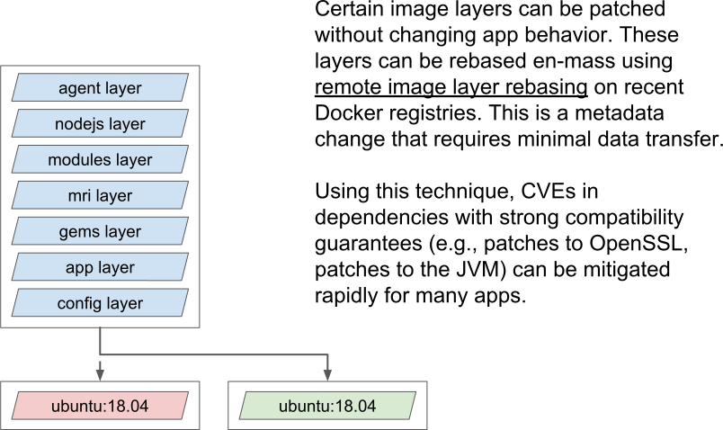

# Platform Interface Specification

This document specifies the interface between a lifecycle and a platform.

A platform orchestrates a lifecycle to make buildpack functionality available to end-users such as application developers.

Examples of a platform might include:

1. A local CLI tool that uses buildpacks to create OCI images
2. A plugin for a continuous integration service that uses buildpacks to create OCI images
3. A cloud application platform that uses buildpacks to build source code before deployment

## Table of Contents

1. [Stacks](#stacks)
   1. [Compatibility Guarantees](#compatibility-guarantees)
   2. [Build Image](#build-image)
   3. [Run Image](#run-image)
2. [Buildpacks](#buildpacks)
   1. [Buildpacks Directory Layout](#buildpacks-directory-layout)
3. [Security Considerations](#security-considerations)
4. [Additional Guidance](#additional-guidance)
   1. [Environment](#environment)
   2. [Run Image Rebasing](#run-image-rebasing)
   3. [Caching](#caching)
5. [Data Format](#data-format)
   1. [order.toml (TOML)](#order.toml-(toml))
   2. [group.toml (TOML)](#group.toml-(toml))

## Stacks

A "stack" refers to:

- A globally unique ID containing at least one period (`.`),
- A set of fully-qualified OCI image tags referring to the same build image, and
- A set of fully-qualified OCI image tags referring to the same run image.

A "stack version" refers to:

- A globally unique ID containing at least one period (`.`),
- A version identifier,
- The image SHA of a build OCI image, and
- The image SHA of a run OCI image.

A "launch layer" refers to a layer created from a  `<launch>/<layer>` directory as specified in the [Buildpack Interface Specification](buildpack.md).

An "app layer" refers to a layer created from the `<app>` directory as specified in the [Buildpack Interface Specification](buildpack.md).

### Compatibility Guarantees

Stack authors SHOULD ensure that build image versions maintain [ABI-compatibility](https://en.wikipedia.org/wiki/Application_binary_interface) with previous versions, although violating this requirement will not change the behavior of previously built images containing app and launch layers.

Stack authors MUST ensure that new run image versions maintain [ABI-compatibility](https://en.wikipedia.org/wiki/Application_binary_interface) with previous versions.
Stack authors MUST ensure that app and launch layers do not change behavior when the run image layers are upgraded to newer versions, unless those behavior changes are intended to fix security vulnerabilities.

### Build Image

The platform MUST execute the detection and build phases of the lifecycle on the build image.

The build image MUST ensure that:

- The image config's `User` field is set to a non-root user with a writable home directory.
- The image config's `Env` field has the environment variable `PACK_STACK_ID` set to the stack ID.
- The image config's `Env` field has the environment variable `PACK_USER_ID` set to the UID of the user specified in the `User` field.
- The image config's `Env` field has the environment variable `PACK_GROUP_ID` set to the primary GID of the user specified in the `User` field.
- The image config's `Label` field has the label `io.buildpacks.stack.id` set to the stack ID.

To initiate the detection phase, the platform MUST invoke the `/lifecycle/detector` executable with the user and environment defined in the build image config.
Invoking this executable with no flags is equivalent to the following invocation including all accepted flags and their default values.

```bash
/lifecycle/detector -buildpacks /buildpacks -order /buildpacks/order.toml -group ./group.toml -plan ./plan.toml
```

Where:

- `-buildpacks` MUST specify input from a buildpacks directory as defined in the [Buildpacks Directory Layout](#buildpacks-directory-layout) section.
- `-order` MUST specify input from an overriding `order.toml` file path as defined in the [Data Format](#data-format) section.
- `-group` MUST specify output to a `group.toml` file path as defined in the [Data Format](#data-format) section.
- `-plan` MUST specify output to a Build Plan as defined in the [Buildpack Interface Specification](#buildpacks-directory-layout).

To initiate the build phase, the platform MUST invoke the `/lifecycle/builder` executable with the user and environment defined in the build image config.
Invoking this executable with no flags is equivalent to the following invocation including all accepted flags and their default values.

```bash
/lifecycle/builder -buildpacks /buildpacks -group ./group.toml -plan ./plan.toml
```

Where:

- `-buildpacks` MUST specify input from a buildpacks directory as defined in the [Buildpacks Directory Layout](#buildpacks-directory-layout) section.
- `-group` MUST specify input from a `group.toml` file path as defined in the [Data Format](#data-format) section.
- `-plan` MUST specify input from a Build Plan as defined in the [Buildpack Interface Specification](buildpack.md).

### Run Image

The platform MUST provide the lifecycle with a reference to the run image during the export phase.

The run image MUST ensure that:

- The image config's `User` field is set to a user with the same UID and primary GID as in the build image.
- The image config's `Label` field has the label `io.buildpacks.stack.id` set to the stack ID.

## Buildpacks

### Buildpacks Directory Layout

The buildpacks directory MUST contain unpackaged buildpacks such that:

- Each top-level directory is a buildpack ID.
- Each second-level directory is a buildpack version and contains the corresponding unpackaged buildpack.
- Each top-level directory contains a `latest` symbolic link, which MUST point to the latest buildpack version directory.

Additionally, there MUST be an [`order.toml`](#order.toml-(toml)) file at the root containing a list of buildpacks groups to use during the detection phase.

## Security Considerations

The platform SHOULD run each phase of the lifecycle in an isolated container to prevent untrusted app and buildpack code from accessing storage credentials needed during the export and analysis phases.
A more thorough explanation is provided in the [Buildpack Interface Specification](buildpack.md).

## Additional Guidance

### Environment

User-provided environment variables intended for build and launch SHOULD NOT come from the same list.
The end-user SHOULD be encouraged to define them separately.
The platform MAY determine the initial environment of the build phase, detection phase, and launch.
The lifecycle MUST NOT assume that all platforms provide an identical environment.

### Run Image Rebasing

Run image rebasing allows for fast stack updates for already-exported OCI images with minimal data transfer when those images are stored on a Docker registry.
When a new stack version is available, the app layers and launch layers SHOULD be rebased on the new run image by updating the image's configuration to point at the new run image.
Once the new run image is present on the registry, no filesystem layers should be uploaded or downloaded.



### Caching

Each platform SHOULD implement caching so as to appropriately optimize performance. Cache locality and availability MAY vary between platforms.

## Data Format

### order.toml (TOML)

```toml
[[groups]]
labels = ["<label name>"]
buildpacks = [
  { id = "<buildpack ID>", version = "<buildpack version>", optional = <bool> }
]
```

Where:

- The buildpack ID MUST be present for each buildpack object in a group.
- The buildpack version MUST default to "latest" if not provided.
- Each buildpack MUST default to not optional if not specified in the object.
- Group labels MAY be present to enable the platform to consider a subset of groups for detection.

Example:

```toml
[[groups]]
labels = ["custom-dotnet"]
buildpacks = [
  { id = "io.buildpacks.nodejs", version = “latest”, optional = true },
  { id = "io.buildpacks.dotnet-core", version = “latest” }
]

[[groups]]
labels = ["custom-ruby", "ruby"]
buildpacks = [
  { id = "io.buildpacks.nodejs", version = “latest”, optional = true },
  { id = "io.buildpacks.ruby", version = “latest” }
]

[[groups]]
labels = ["ruby-datascience", "ruby"]
buildpacks = [
  { id = "io.buildpacks.python", version = “latest” },
  { id = "io.buildpacks.ruby", version = “latest” }
]
```

### group.toml (TOML)

```toml
buildpacks = [
  { id = "<buildpack ID>", version = "<buildpack version>" }
]
```

Where:

- The buildpack ID MUST be present for each buildpack object in a group.
- The buildpack version MUST default to "latest" if not provided.

